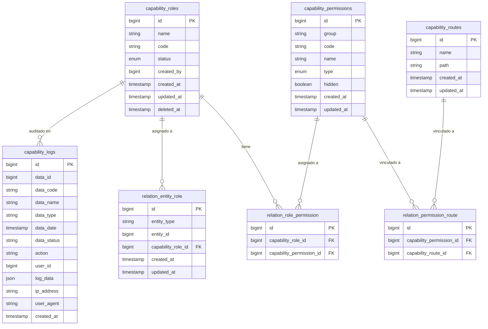

# Lechuga Negra - AccessManager para Laravel

Este paquete de Laravel proporciona una solución integral para la gestión de accesos en tus aplicaciones, permitiendo la definición de roles, permisos agrupados y rutas, con una lógica de relaciones muchos a muchos entre roles y permisos. Además, incluye un middleware para la validación de permisos en rutas, asegurando un control de acceso robusto y flexible.

## Características Principales

* **Gestión de Roles:** Define roles con distintos niveles de acceso, permitiendo una administración granular de privilegios.
* **Banco de Permisos:** Asigna permisos específicos a roles, agrupados por contexto para facilitar su administración.
* **Asociación de Rutas:** Vincula permisos a rutas de forma opcional. Si una ruta no está registrada, el comportamiento depende de la variable `ACCESS_MANAGER_STRICT_ROUTES`.
* **Middleware de Validación:** Valida los permisos de las rutas mediante un middleware, asegurando que solo los usuarios autorizados puedan acceder a ellas.
* **Arrancador de Capacidades:** Archivo de configuración que permite el registro de permisos agrupados y rutas.
* **Personalización del Modelo de Usuario:** Permite utilizar un modelo de usuario personalizado, adaptándose a las necesidades de cada proyecto.
* **Log de Auditoría:** Registra automáticamente las acciones de creación, actualización y eliminación de roles en `capability_logs`, incluyendo el usuario que ejecutó la acción, IP, user agent y snapshot de datos.

## Estructura de Base de Datos



## Instalación

1.  **Crear grupo de paquetes:**

    Crear la carpeta packages en la raíz del proyecto e ingresar a la carpeta:

    ```bash
    mkdir packages
    cd packages
    ```

    Crear el grupo de carpetas dentro de la carpeta creada, e ingresar a l carpeta:

    ```bash
    mkdir lechuganegra
    cd lechuganegra
    ```

2.  **Clonar el paquete:**

    Clonar el paquete en el grupo de carpetas creado y renombrarlo para que el Provider pueda registrarlo en la instalación

    ```bash
    git clone https://github.com/mtorres-lechuganegra/package-accessmanager.git accessmanager
    ```

3.  **Configurar composer del proyecto:**

    Dirígite a la raíz de tu proyecto, edita tu archivo `composer.json` y añade el paquete como repositorio:

    ```json
    {
        "repositories": [
            {
                "type": "path",
                "url": "packages/lechuganegra/accessmanager"
            }
        ]
    }
    ```
    también deberás añadir el namespace del paquete al autoloading de PSR-4:

    ```json
    {
        "autoload": {
            "psr-4": {
                "LechugaNegra\\AccessManager\\": "packages/lechuganegra/accessmanager/src/"
            }
        }
    }
    ```

4.  **Ejecutar composer require:**

    Después de editar tu archivo, abre tu terminal y ejecuta el siguiente comando para agregar el paquete a las dependencias de tu proyecto:

    ```bash
    composer require lechuganegra/accessmanager:@dev
    ```

    Este comando descargará el paquete y actualizará tu archivo `composer.json`.

5.  **Publicar archivo de configuración:**

    Ejecuta el siguiente comando para copiar los archivos de configuración del paquete a la carpeta `config` del proyecto::

    ```bash
    php artisan vendor:publish --tag=accessmanager-config

    ```

    Esto te permitirá personalizar el comportamiento del paquete desde tu proyecto.

6.  **Configurar el modelo de usuario (opcional):**

    Puedes editar el archivo `config/accessmanager.php` y modifica la entrada `user_entity` con la información de tu modelo:

    ```php
    'user_entity' => [
        'model' => App\Models\User::class, // Reemplaza con tu modelo
        'table' => 'users' // Reemplaza con el nombre de tu tabla
    ],
    ```

7.  **Ejecutar las migraciones:**

    Ejecuta las migraciones del paquete para crear las tablas necesarias en la base de datos:

    ```bash
    php artisan migrate --path=packages/lechuganegra/accessmanager/src/Database/Migrations
    ```

    **Nota:** Esta migración agrega un campo `admin` a la tabla de usuarios. Se recomienda no incluir este campo en el atributo `fillable` del modelo para evitar modificaciones accidentales.

8.  **Ejecutar el seeder:**

    Ejecuta el seeder del paquete para poblar las tablas con datos iniciales:

    ```bash
    php artisan db:seed --class="LechugaNegra\\AccessManager\\Database\\Seeders\\DatabaseSeeder"
    ```

9.  **Limpiar la caché:**

    Limpia la caché de configuración y rutas para asegurar que los cambios se apliquen correctamente:

    ```bash
    php artisan config:clear
    php artisan config:cache
    php artisan route:clear
    php artisan route:cache
    ```

10.  **Regenerar clases:**

    Regenerar las clases con el cargador automático "autoload"

    ```bash
    composer dump-autoload
    ```

## Uso

### Endpoints del Servicio

Puede importar el archivo `postman_collection.json` que se ubica en la carpeta `docs` de la raíz del paquete.

### Variables de Entorno

Puede determinar el comportamiento del paquete mediante las siguientes variables de entorno:

**Modelo de usuario**

```env
ACCESS_MANAGER_USER_MODEL=App\Models\User
ACCESS_MANAGER_USER_TABLE=users
```

- `ACCESS_MANAGER_USER_MODEL`: Clase del modelo de usuario de tu proyecto.
- `ACCESS_MANAGER_USER_TABLE`: Nombre de la tabla de usuarios en la base de datos.

**Sincronización de permisos y rutas**

```env
ACCESS_MANAGER_STRICT_SYNC=false
```

- `false` (default): Sincronización aditiva — agrega nuevos permisos y rutas sin eliminar los existentes.
- `true`: Sincronización estricta — elimina los permisos y rutas que ya no estén definidos en la configuración.

**Restricción de acceso por ruta**

```env
ACCESS_MANAGER_STRICT_ROUTES=true
```

- `true` (default): Bloquea con 403 si la ruta no está registrada en `capability_routes`. Recomendado para producción.
- `false`: Permite el acceso si la ruta no está registrada. Útil durante desarrollo.

### Middleware de Validación

Para proteger tus rutas con el middleware de validación de permisos, utiliza `capability.access` en tus definiciones de rutas:

```php
Route::middleware(['capability.access'])->group(function () {
    // Rutas protegidas
});
```

### Asignar Roles

Para poder asignar roles a una entidad, es importante generar una relación polimórfica personalizada para relacionar el puente de comunicación entre la entidad (modelo) a capability_roles.

Usar el modelo que funcionará como puente de comunicación en una relación polimórfica de muchos a muchos:

```php
use Lechuganegra\AccessManager\Models\RelationEntityRole;
```

Agregar la función de relación através del puente de conexión:

```php
public function roles()
{
    return $this->morphMany(RelationEntityRole::class, 'entity', 'entity_type', 'entity_id');
}
```

Dirígete al archivo `AppServiceProvider.php`, y en tu boot de arranque, agregar la entidad que deseas vincular a la relación con roles, invocar la librería eloquent de relación:

```php
use Illuminate\Database\Eloquent\Relations\Relation;
```

Agregar las entidades que desees, separado por `,`:

```php
Relation::morphMap([
    'user' => \App\Models\User::class,
]);
```

### Diagnóstico del Sistema

El paquete incluye un comando artisan para verificar el estado de permisos y rutas registradas:

```bash
php artisan accessmanager:check
```

Este comando realiza tres verificaciones:

- **Permisos sin rutas asociadas:** Lista los permisos que no tienen ninguna ruta vinculada.
- **Rutas sin permisos asociados:** Lista las rutas registradas en BD que no tienen ningún permiso vinculado.
- **Rutas huérfanas:** Lista las rutas registradas en BD que ya no existen en Laravel.

## Upgrade Guide

### v1.x → v2.0.0

**Cambios breaking:**

- `capability_modules` eliminada — los permisos ahora se agrupan con la columna `group` en `capability_permissions`
- `entity_module` renombrado a `entity_type` en `relation_entity_role`
- `created_by` en `capability_roles` ya no tiene FK a `users`
- Config `accessmanager_seeders.modules` renombrado a `accessmanager_seeders.groups`
- Ruta `session/permissions` movida fuera del middleware `capability.access`

**Pasos para migrar:**

1. Actualiza el paquete a v2.0.0
2. Ejecuta las migraciones — migrarán los datos automáticamente:
```bash
php artisan migrate --path=packages/lechuganegra/accessmanager/src/Database/Migrations
```
3. Actualiza tu `accessmanager_seeders.php` — renombra la clave `modules` por `groups` y elimina el campo `name` del grupo
4. Si usas `entity_module` en tu código para asignar roles, cámbialo a `entity_type`
5. Si tienes la ruta `session/permissions` dentro de un grupo `capability.access`, sácala y déjala solo con `auth:api`
